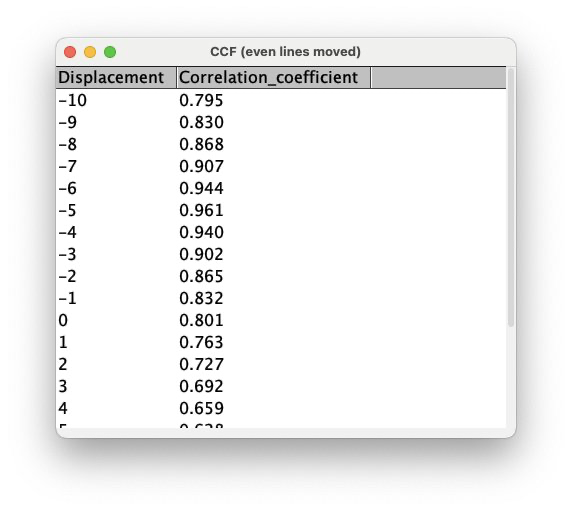

# IJ-Plugin_Phase-Correction
*This plugin is aimed at correcting the phase shift sometimes encountered when using a confocal microscope in bi-directionnal scanning mode*

## Installation
1. Make sure you are running at least **ImageJ v1.54f**: Update ImageJ using the "Help/Update ImageJ" menu.
2. Download the __Phase_Correction.jar plugin__ from the [release page](https://github.com/fabricecordelieres/IJ-Plugin_Phase-Correction/releases).
3. Drag-and-drop it to the ImageJ toolbar: a dialog box will pop-up, requesting the user to point at the destination folder. By default, the ImageJ/Plugins folder should be selected: press Ok to validate.

## What does it do ?
Under the hood, the plugin will generate two images: one for the odd lines, one for the even lines. A correlation coefficient is computed from the pixel intensities of both images (roughly: describes how well the intensities are matching, pixel per pixel). One of the two images (user-defined) is shifted by one pixel and the correlation coefficient is computed again. This step is repeated a user-defined number of times, both towards the left and towards the right. When plotting the cross-correlation function (CCF, correlation coefficient as a function of the displacement), a pick should emerge: it corresponds to the maximum of correlation, found when the odd and even lines are aligned.

  

_An example of manually introduices shifts, and results of automatically finding the ideal shift-back._
NB: This plugin provides a way to correct images a priori, with a precision limited to the pixel unit. Ideally, the phase corection should be done during the acquisition, where corrective measures could be done with a higher accuracy (higher than the single pixel accuracy).

## How to use it ?
This plugin provides two options: depending on your needs, please use the appropriate one:

## Manual correction
1. You'll find the plugin under "Plugins/Phase Correction/Manual Phase Correction": click on the menu entry.
2. The following interface should be displayed:

  

* ***Phase correction (pixels)***: number of pixel the odd or even lines should be move relative to the other lines. Positive values will move the lines towards the right, negative towards left. NB: the correction is applied horizontally. Should you need another direction, please rotate the image first (be careful about rotation angles and potential interpolation options).
* ***Which lines to move ?***: defines which lines are to be moved (odd or even).
* ***Suggested value***: at start-up, the plugin computes the CCF over a \[-20 pixels; +20 pixels\] range, and defines where its peak stands: this line provide the result as a suggested value.
* ***Preview***: live visualization of the shift, on the current image/current slice.
3. When pressing Ok, the correction is applied. In case the input image is a stack, a popup-up window may appear to define weither the shift should to all slices.

NB: This plugin is fully macro recordable.

## Automatic correction
1. You'll find the plugin under "Plugins/Phase Correction/Automated Phase Correction": click on the menu entry.
2. The following interface should be displayed:

  

* ***Maximum phase correction (pixels)***: number of pixel the odd or even lines should be move relative to the other lines. Positive values will move the lines towards the right, negative towards left. NB: the correction is applied horizontally. Should you need another direction, please rotate the image first (be careful about rotation angles and potential interpolation options).
* ***Which lines to move ?***: defines which lines are to be moved (odd or even).
* ***Show graph***: tick the box in case you want to display the CCF curve.
  

  

* ***Show table***: tick the box in case you want to display the CCF values.

  

* ***Show log***: when enabeling this option, two lines are added to the log window, carrying the information about which lines where move and the automatically defined displacement.

  

* ***Preview***: live visualization of the shift, on the current image/current slice.
3. When pressing Ok, the correction is applied. In case the input image is a stack, a popup-up window may appear to define weither the shift should to all slices.

NB: This plugin is fully macro recordable.

# Versions
## 2024/11/15: Version 1.0
Initial release
